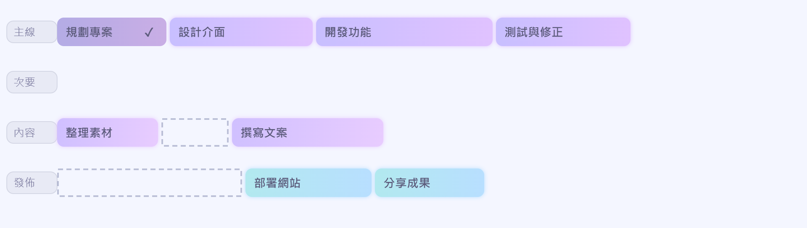

# LumaTrack

一個把甘特圖的時間可視化與 To-Do List 融合在一起的霓虹任務軌道。

[線上體驗](https://x200706.github.io/LumaTrack/) · [功能介紹](#功能特色) · [語法說明](#lumatrack-語法)



## 為什麼做 LumaTrack？

To-Do List 裡一條又一條的事項，有時會讓人覺得事情永遠做不完；行事曆若被排得滿滿的，又很像一張壓力很大的課表。甘特圖能把先後、長短與並行關係畫出來，但使用 Notion 或 Excel 製作時，維護和調整往往不夠輕巧。

LumaTrack 借用甘特圖「把時間變成形狀」的概念，再加入待辦事項會完成、會改變的動態。它刻意不以精確時刻為核心，而是讓人專注於事項之間的相對長度、進度與完成感，試著用更直覺的視覺降低安排事情時的焦慮。

開發過程中，我曾經反覆考慮要不要加入正式的時間軸。最後選擇先把焦點留給「完成事項」與「時間可視化」：如果需要精確日期或時刻，可以把匯出的圖片放進自己的筆記工具，再加上註記。LumaTrack 想做的不是另一套行事曆，而是一張看得見、也能持續變化的行動地圖。

## 功能特色

- **文字即圖表**：輸入簡潔的 LumaTrack 語法，即時產生甘特圖。
- **簡易模式**：不必先學語法，一行輸入一件事，內容會自動排進「主線」。
- **視覺化編排**：拖曳事項方塊即可重新排序，也能移到不同軸線。
- **調整長度**：按住方塊右側的調整區，左右滑動即可改變長度。
- **Todo Check**：點一下事項標記完成，再點一下即可取消。
- **深淺色模式**：依照情境切換霓虹深色或柔和淺色外觀。
- **匯出 PNG**：以當下的深／淺色模式輸出完整圖表。
- **免安裝、免建置**：整個網站只有一個 `index.html`，瀏覽器開啟即可使用。

## 快速開始

### 線上使用

直接開啟 [LumaTrack](https://x200706.github.io/LumaTrack/)，在上方輸入內容即可開始。

### 本機使用

```bash
git clone https://github.com/x200706/LumaTrack.git
cd LumaTrack
```

接著直接用瀏覽器開啟 `index.html`，不需要安裝套件或執行建置指令。

## LumaTrack 語法

### 簡易模式

每一行都是一個事項；沒有指定軸線時，所有內容預設放進「主線」。

```text
確認需求
設計介面
開發功能
測試與修正
```

### 建立軸線：`>`

在行首使用大於號 `>` 開啟一條軸線，後續事項會放進該軸，直到遇到下一個 `>`。

```text
>主線
確認需求
設計介面
>內容
整理素材
撰寫文案
```

### 建立空白格：`__`

兩個底線 `__` 代表空白格，可以把後面的事項向右推，呈現等待或同步進行的關係。

```text
>主線
開發功能|200
>內容
__|120
撰寫文案|160
```

### 指定長度與完成狀態

事項後方可以用 `|` 指定方塊寬度；完成狀態會由點擊操作自動寫回，也可以直接使用 `|done`。

```text
事項名稱|寬度
已完成事項|160|done
```

例如：

```text
>主線
規劃專案|130|done
設計介面|170
開發功能|210
測試與修正|160
>內容
整理素材|120
__|80
撰寫文案|180
```

## 圖表操作

1. **完成／取消完成**：點擊非空白事項方塊。
2. **重新排序**：按住方塊本體並拖曳，可調整前後順序或移到其他軸線。
3. **改變長度**：按住方塊右側的調整區，左右滑動至需要的長度。
4. **切換主題**：使用右上角的月亮／太陽按鈕。
5. **匯出圖片**：按下「匯出 PNG」，輸出結果會沿用目前主題。

拖曳或調整後，文字區內容會同步更新，因此圖表和語法可以交替編輯。

## 已知問題與預計更新

- [ ] 持續調整整體配色。
- [ ] 為按鈕加入 hover 效果，增加操作時的動態感。
- [ ] 縮小或重新設計方塊右側的長度調整區；目前它的隱形操作範圍較大，使方塊靠右的位置不容易用來拖曳排序。
- [ ] 改善點擊與拖曳的判定；目前點擊方塊左側時，偶爾會先觸發抓取再切換完成狀態，游標也可能閃動。
- [ ] 測試並調整手機版；目前僅完成桌面版的功能與問題檢查。

## 技術說明

LumaTrack 使用原生 HTML、CSS 與 JavaScript 製作，沒有框架與建置流程。字型與圖示分別透過 Google Fonts 與 Font Awesome CDN 載入。

## 授權

本專案採用 [MIT License](LICENSE)。
